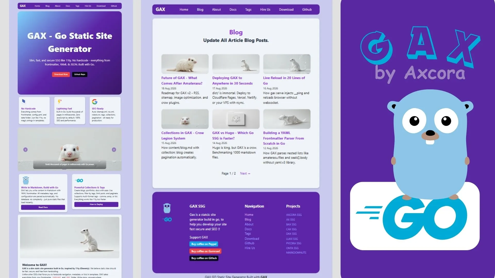

# GAX - Fast Static Site Generator in Go

Minimal, fast, and simple alternative to Hugo. Built with Go.



Run Starter Demo: [https://gax.axcora.com/starter/](https://gax.axcora.com/starter/)

Official Site: [https://gax.axcora.com/](https://gax.axcora.com/)

Documentation: [https://gax.axcora.com/docs/](https://gax.axcora.com/docs/)

---

### Buy A Cup of Coffee

**GitHub:**
[Buy Coffe via Github](https://github.com/sponsors/mesinkasir)

**PayPal:**
[Buy Coffe via Paypal](https://www.paypal.com/cgi-bin/webscr?cmd=_s-xclick&hosted_button_id=JVZVXBC4N9DAN)

**Gumroad:**
[Buy Coffe via Gumroad](https://creativitaz.gumroad.com/coffee)

---

## Installation

### Option 1: Go Install (Recommended for Developers)

```bash
go install github.com/mesinkasir/gax/cmd/gax@latest
gax
```

### Option 2: Download Binary (Gumroad / Releases)

Download gax-starter.zip from Gumroad or GitHub Releases

Download from gumroad: [https://creativitaz.gumroad.com/l/gax](https://creativitaz.gumroad.com/l/gax)

Extract

#### Windows

For windows run this command:
```
double click gax.exe
```

#### Linux/Mac: 

For linux/Mac run this command:
```
./gax (chmod +x gax if needed)
```

### Option 3: Build from Source

Open terminal and run this command

```
git clone https://github.com/mesinkasir/gax.git
cd gax
go mod tidy
go build -o gax ./cmd/gax
./gax
```

---

## Usage

How to use GAX SSG

### Development

Dev mode with live reload:
```bash
./gax
# or
./gax start
# or for dev without binary
go run./cmd/gax start
```

Production Build
```
./gax build
# or
go run./cmd/gax build

# Output in /site folder
```

Full Commands
```
./gax # =./gax start (dev server)
./gax start # Start dev server with live reload
./gax build # Build to /site for production
./gax --help # Show help
```

---

### Folder Structure

GAX GO SSG Folder Architecture:
```
content/ - Your markdown pages (file-based routing)
_data/config.yaml - Site config
templates/ - Layouts and partials (.gax files)
public/ - Static assets (css, images)
site/ - Generated static site (deploy this)
```

## Deploy

How to deploy GAX GO SSG in to all hosting server

### GitHub Pages
Deploy your GAX project into Github Pages
1. Push to GitHub
2. Go to Settings > Pages > Source: GitHub Actions
3. Workflow open rename `.github/workflows/deploy.yml.example` to be `.github/workflows/deploy.yml` will auto deploy

### Netlify / Vercel / Cloudflare
Deploy your GAX Project into Vercel / Netlify / CloudFlare
+ Build command: `go build -o gax ./cmd/gax && ./gax build`
+ Publish directory: site

### cPanel / VPS
How to deploy your GAX SSG project in to Cpanel or VPS
See `.github/workflows/deploy-cpanel.yml.example` and `deploy-vps.yml.example`

---

### Run This Project Demo

Run Starter Demo: [https://gax.axcora.com/starter/](https://gax.axcora.com/starter/)

Official Site: [https://gax.axcora.com/](https://gax.axcora.com/)

Documentation: [https://gax.axcora.com/docs/](https://gax.axcora.com/docs/)

---

### Support This Project

GAX is open source and free forever. If you find it useful, please consider supporting:

**GitHub:**
[Support Via Github](https://github.com/sponsors/mesinkasir)

**PayPal:**
[Support Via Paypal](https://www.paypal.com/cgi-bin/webscr?cmd=_s-xclick&hosted_button_id=JVZVXBC4N9DAN)

**Gumroad:**
[Support Via Gumroad](https://creativitaz.gumroad.com/coffee)

Your support helps us maintain, improve, and add more features to GAX.
